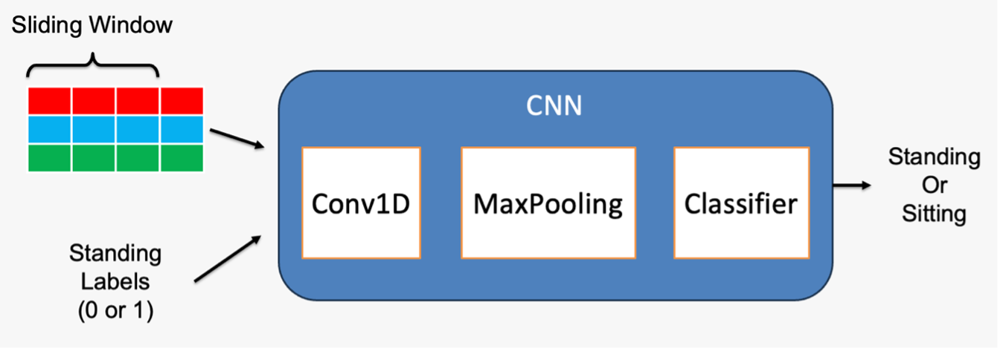

# Cow Posture Analysis Using CNN

## Overview

This past semester I was involved in the Cow Ear Tag Dataset project, specifically in the sensor data analysis and prediction section. My responsibility in this project was focused on using the accelerometer data to predict cow posture (whether the cow as standing or sitting). I wanted to test the single day single tag accuracy of the model, as well as how transferable the model was from cow to cow and from day to day.

I built a pipeline that processed the collected accelerometer data and associated labels and trained a simple CNN model to predict the cow's posture. Because CNN models are supervised, we used HOBO ankle sensor data to generate posture labels for the cows. Because the ankle sensor can very accurately track the movement of the cow, these posture labels can reasonably be used as ground truths for the model. A pure CNN model was chosen for its speed and accuracy. I also tried training with LSTM and CNN-LSTM models, but they were much slower and produced no measurable increase in accuracy.

I also examined whether truncating bits of the accelerometer data (stored in float16 format) would cause a drop in the accuracy of the model. I tested the model with 14, 12-, 10-, 8-, and 6-bit data. To create this truncated data, I converted the float16 sensor value to binary, truncated the number of bits I wanted, and then converted the binary back to a float16 value.

## Breakdown of the Processing and Training Pipeline

1. **Load in sensor and label data CSVs with pandas**
    1. These CSVs were organized with each row being an event containing the timestamp and either sensor data or associated label
2. **Standardize sampling rate**
    1. It's important to note that the ear tag accelerometer has a sampling rate of 10 Hz, and the HOBO ankle sensor has a sampling rate of once per minute. To get rid of these inconsistencies I standardized everything to a sampling rate of 10 Hz
    2. To do this I merged the data frame containing the labels data with a data frame with timestamps every .1 second from the first label timestamp to the last label timestamp. I then used panda's bfill() method to fill in all the missing data
3. **Create sliding window data**
    1. For this project, I decided to process the data using a sliding window to maximize the training points I was able to extract from the data.
    2. To create sliding window data, I chose a window size (5 minutes) and stored all the sensor data within that window in X data array, and the associated label in the y data array. I then increased the beginning and end of the window by the sample rate base time (in this case 0.1 seconds) and repeated this process.
    3. It's important to note that processing data in this way will encounter windows of transition where the cow isn't standing/sitting for the entire duration of the window. When this happened, I discarded the data in this window until I had a window where the cow was entirely standing/sitting
4. **Train/ Test Split**
    1. The train/ test split I used on the data relied on the type of experiment I was conducting:
        1. When conducting an experiment on a single cow on a single day, I used a 70/30 split on the data
        2. Additionally, when I pooled together all the cow data from all the days to test the overall transferability of the model, I used a 70/30 split
        3. When testing the day to day and cow to cow transferability of the model, I trained the model on almost all cows or almost all days data, and tested on one days or one cows data
5. **Model Architecture**
    1. For this project, I built a CNN model in TensorFlow with the following architecture:
        1. Input with shape [# of timesteps per window, # of features per timestep]
        2. Conv1D (filters=64, kernel size= 4)
        3. Conv1D (filters=64, kernel size= 4)
        4. MaxPooling1D (pool size=2)
        5. Dense (100)
        6. Dense (# of outputs)
    2. I trained this model on the data 10 times for each experiment, and averaged the accuracies to get the final accuracy of the experiment

## Breakdown of Bit Truncation

1. **Convert Float16 to Binary**
    1. To get the 16-bit representation of the sensor data, first I casted the float value as a NumPy float16 value.
    2. I then used the python bin() method to convert the float16 to a string of 16-bit binary
2. **Downsize Binary**
    1. To downsize the binary value, I simply right shift the binary string by the amount of bits I want to get rid of (e.g. right shift 4 to downsize to 12-bit data) and then fill the string with zeros until it's back to 16-bits. This is essentially zeroing the least significant bits of the float16 binary representation
3. **Convert Binary to Hex**
    1. To convert the binary string to a hex string, I converted the binary string to an int value using the int() method
    2. I then used the hex() method on the int representation to get the hex representation of the given binary
4. **Convert Hex back to Float16**
    1. To convert the hex value back to a float16, I converted the hex into an int and then a binary string using the bin() method (reverse of the above steps)
    2. Finally, to convert the binary string back to a float16 by unpacking the binary string using the struct library

## Results

The CNN model achieved a **98%** accuracy on the single day single cow 70/30 split. On the entire dataset pooling experiment, the CNN achieved a **56%** accuracy, which shows that in its current state, the model can't generalize over all the cows on all the days.

Additionally, truncating bits off the sensor data down to 6-bits had no demonstrable effect on the accuracy of the model, which stayed at **96%** when trained on 16-bit data and tested with the truncated bit data.
